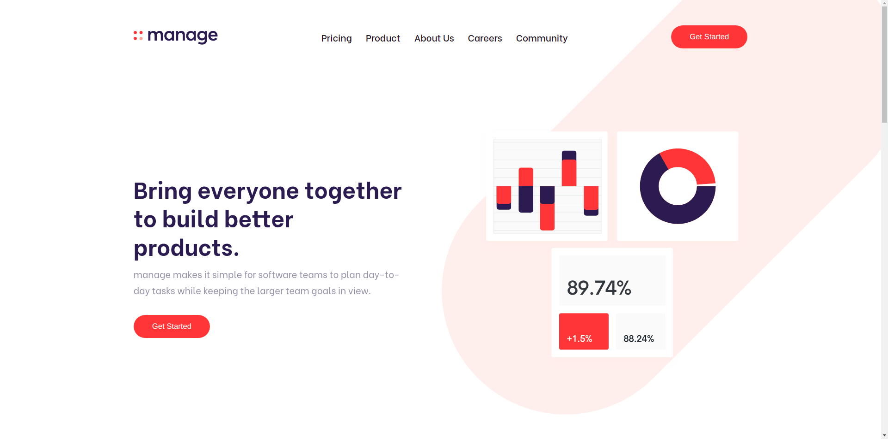

# Frontend Mentor - Manage landing page solution

This is a solution to the [Manage landing page challenge on Frontend Mentor](https://www.frontendmentor.io/challenges/manage-landing-page-SLXqC6P5). Frontend Mentor challenges help you improve your coding skills by building realistic projects.

## Overview

### The challenge

Users should be able to:

- View the optimal layout for the site depending on their device's screen size
- See hover states for all interactive elements on the page
- See all testimonials in a horizontal slider
- Receive an error message when the newsletter sign up `form` is submitted if:
  - The `input` field is empty
  - The email address is not formatted correctly

### Links

- Solution URL: [Repo](https://github.com/AlecANL/managment-lp)
- Live Site URL: [Live Demo](https://alecanl.github.io/managment-lp/)

## My process

### Built with

- Semantic HTML5 markup
- CSS custom properties
- Flexbox
- CSS Grid
- Mobile-first workflow

## Author

- Website - [Portfolio](https://alec-portfolio-dev.vercel.app/)
- Frontend Mentor - [@alecanl](https://www.frontendmentor.io/profile/AlecANL)
- Twitter - [@alexei_alvarez4](https://www.twitter.com/alexei_alvarez4)
